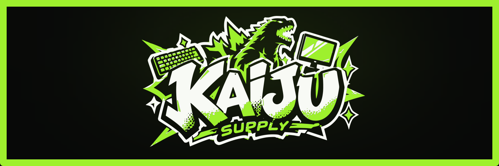

<h1>Proposta de Site</h1>

 &nbsp; A Kaiju Supply é uma <strong>marca fictícia</strong> para a distribuição de computadores e periféricos, criada com fins educativos. O projeto foi desenvolvido como uma forma de aprender e praticar linguagens de programação, mas decidi continuar seu desenvolvimento para expandir meus conhecimentos e utilizá-lo como um projeto de estudo.

<h2>Ferramentas e tecnologias</h2>

 
 
 

        
          
